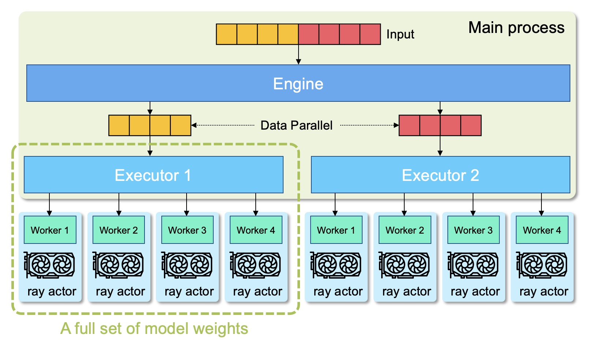
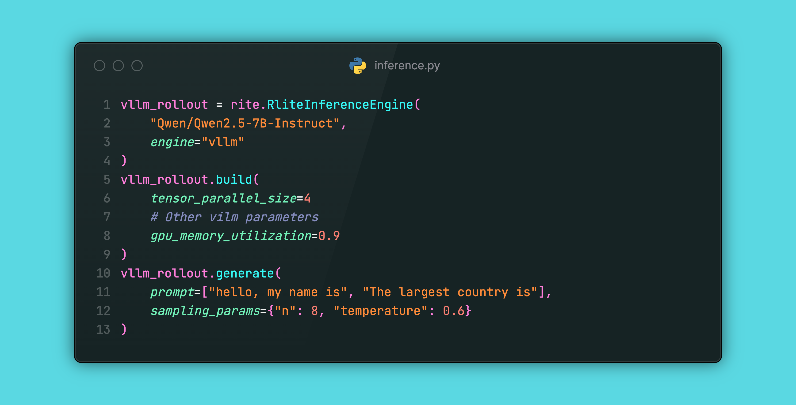
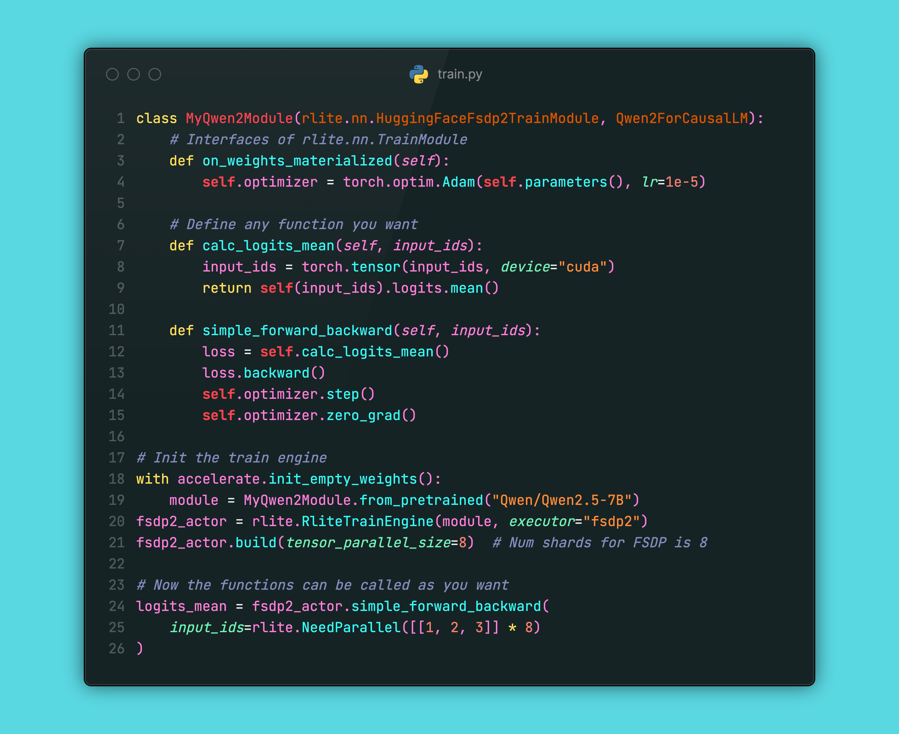
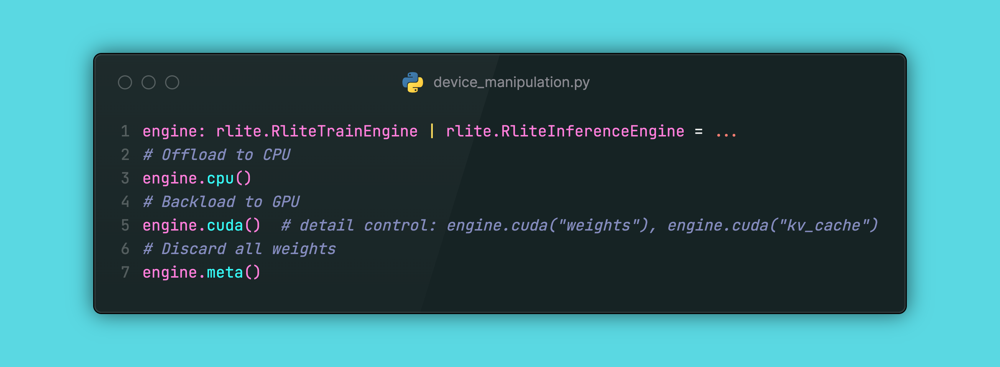
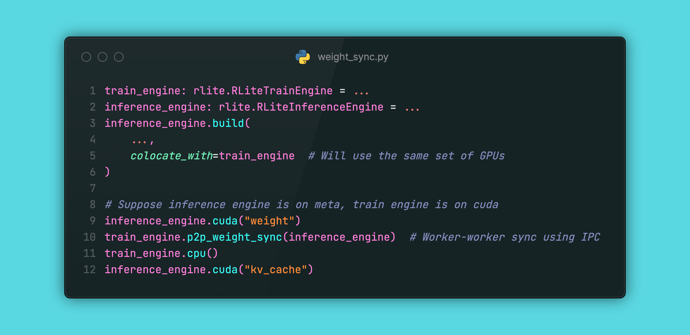

<div align="center">


<p align="center">
  <a href="https://rlite-documentation.readthedocs.io/en/latest/quick_start.html" style="margin: 0 10px;">🚀 Quick start</a> •
  <a href="https://github.com/rlite-project/RLite/tree/main/examples">🌰 Examples</a> •
  <a href="https://github.com/rlite-project/RLite-Recipe">🍲 Recipes</a> •
  <a href="https://rlite-documentation.readthedocs.io/en/latest/">📚 Docs</a>
</p>

A lightweight RL framework with PyTorch-like interfaces.

</div>

## Features

- **FSDP2** and **FSDP** support for training.
- `vLLM` support for inference.
- `ray` support for resource management.
- Easy to learn and use. Most interfaces are kept the same as Torch, with parallel engine working seamlessly behind the scenes.
- [Recipes](https://github.com/rlite-project/RLite-Recipe) that reproduce SOTA results with a single self-contained python script.

## Installation

```python
pip install pyrlite
```

<details>

<summary>Advanced installation options</summary>

We recommend using `conda` to manage our computation environment.

1. Create a conda environment:

```
conda create -n rlite python==3.12
conda activate rlite
```

2. Install common dependencies

```bash
# install vllm
pip install vllm accelerate

# flash attention 2 (make sure you have 64 CPU cores)
MAX_JOBS=64 pip install flash-attn --no-build-isolation

# Install fashinfer for faster inference
pip install flashinfer-python==0.2.2.post1 -i https://flashinfer.ai/whl/cu124/torch2.6
```

4. Install `rlite`

```bash
git clone https://github.com/rlite-project/RLite.git
cd RLite; pip install -e .
```

</details>

## Recipes

We use [recipes](https://github.com/rlite-project/RLite-Recipe) as examples for reproducing SOTA RL methods. Featured recipes

- [Vanilla GRPO](https://github.com/rlite-project/RLite-Recipe/tree/main/recipe/on_policy_grpo_math_verifiable_reward)
- [LoRA GRPO](https://github.com/rlite-project/RLite-Recipe/tree/main/recipe/grpo_lora)
- [Reproduction of Open-Reasoner-Zero](https://github.com/rlite-project/RLite-Recipe/tree/main/recipe/reproduce_orz)

## Programming Model



In RLite, users mainly work with **Engine**s, which is a handler that takes the input from the main process, organizes the tasks and sends to the workers. The engine may have multiple **Executor**s, each holding a full set of model weights. Both Engines and Executors reside in the main process. The **Worker**s are the units that actually perform computational tasks, with each Worker corresponding to a GPU. Conversely, a single GPU can be associated with multiple Workers, which can use the GPU in a time-multiplexed manner.

## Key Interfaces

RLite provide minimal interfaces that are

- **easy to learn**: most interfaces resembles the behavior of PyTorch.
- **super flexible**: interfaces are independent and can be used seperately. This allows inference without training, e.g. evaluation tasks, or training without inference, e.g. SFT and DPO.
- **super powerful**: the interfaces combined together allows reproduction of SOTA RL results.
- **highly extensible**: the interfaces allows extensions for fancy features such as other train/inference backends, streaming generations for multi-turn use cases, asynchronized workers for overlapping time-consuming operations.

### Inference



### Train



### Offload/Reload/Discard Weights



### Synchronize Weights



## Join Our Discussion on WeChat


## Contributing

<details>
<summary>Developer's guide.</summary>

<br>

> Write code that you would like to read again.

We use `pre-commit` and `git cz` to sanitize the commits. You can run `pre-commit` before `git cz` to avoid repeatedly input the commit messages.

```bash
pip install pre-commit
# Install pre-commit hooks
pre-commit install
pre-commit install --hook-type commit-msg
# Install this emoji-style tool
sudo npm install -g git-cz --no-audit --verbose --registry=https://registry.npmmirror.com

# Install rlite
pip install -e ".[dev]"
```

##### Code Style

- Single line code length is 99 characters, comments and documents are 79 characters.
- Write unit tests for atomic capabilities to ensure that `pytest` does not throw an error.

Run `pre-commit` to automatically lint the code:

```
pre-commit run --all-files
```

##### Run Unit Tests:

```bash
# Only run tests
pytest

# Run tests and output test code coverage report
pytest --cov=rlite
```

#### Debug with VSCode

##### Preparation

Install `Command Variable` extension of VSCode. Add a `launch.json` under `.vscode/`, with the following content:

```json
{
  "version": "0.2.0",
  "configurations": [
    {
      "name": "Python: Attach Dynamic",
      "type": "debugpy",
      "request": "attach",
      "connect": {
        "host": "${input:host}",
        "port": "${input:port}"
      },
      "pathMappings": [
        {
          "localRoot": "${workspaceFolder}",
          "remoteRoot": "."
        }
      ]
    }
  ],
  "inputs": [
    {
      "id": "host",
      "type": "command",
      "command": "extension.commandvariable.transform",
      "args": {
        "text": "${promptStringRemember:hostPort}",
        "find": ":.*",
        "replace": "",
        "promptStringRemember": {
          "hostPort": {
            "key": "hostPort",
            "description": "Input host:port",
          }
        }
      }
    },
    {
      "id": "port",
      "type": "command",
      "command": "extension.commandvariable.transform",
      "args": {
        "text": "${remember:hostPort}",
        "find": ".*:",
        "replace": ""
      }
    }
  ]
}
```

##### Debug by attaching to remote workers

1. Insert `breakpoint()` to the code you want to debug.
2. Run the code until you see a message containing the IP:Port you can attach to.
3. Copy the IP:Port, press F5, and paste the IP:Port to the prompted box.

You should ba able to attach your VSCode to the breakpoint.

</details>
